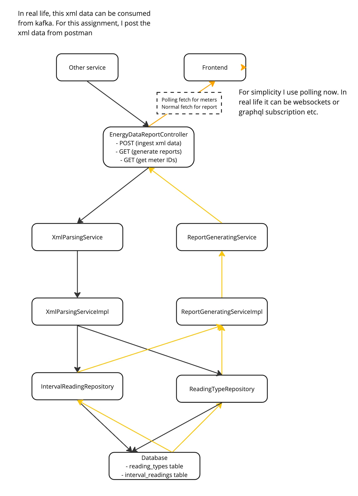

# Application Overview
A solution where you parse the xml files and build a report which contains the hourly energy values, the price per hour and the sum of energy and price per meter.

## How to run
- Prerequisites:
  - Node.js and npm
  - Java version: 21 or higher
  - Build tool: maven

- Frontend: 
  - Install dependencies: npm install 
  - Run: npm run dev

- Backend: 
  - Install dependencies: mvn clean install
  - Run: mvn spring-boot:run

- Steps:
  - Post xml data via  `/api/data`
  - Check the browser: http://localhost:5173/
  - The dropdown selector should show the meterId of the posted xml data
  - Select one meterId and see the report ;)

---

# Backend API Documentation

## Overview
This backend provides a REST API for managing energy data. The main functionalities include:
- Ingesting XML energy data.
- Generating reports for specific meters.
- Retrieving all available meter IDs.

## Endpoints

| HTTP Method | Endpoint       | Description                                   | Request Body / Params                     | Response                       | Content Type         |
|-------------|----------------|-----------------------------------------------|-------------------------------------------|--------------------------------|----------------------|
| POST        | `/api/data`    | Ingest XML data for energy readings.          | XML String in the request body.           | HTTP 200 OK                   | `application/xml`    |
| GET         | `/api/report`  | Retrieve a report for a specific meter.       | Query param: `meterId` (string).          | JSON: `ReportDto`             | `application/json`   |
| GET         | `/api/meters`  | Retrieve all available meter IDs.             | None                                      | JSON: List of meter IDs        | `application/json`   |

- Example Request Body for POST:

```
<feed>
    <id>123</id>
    <title type="text">Feed</title>
    <entry>
        <content>
            <ReadingType>
                <flowDirection>1</flowDirection>           
                <kWhPrice>0.08</kWhPrice>                
                <readingUnit>kWh</readingUnit>
            </ReadingType>
        </content>
    </entry>
    <entry>
        <content>
            <IntervalBlock>
                <IntervalReading>
                    <timePeriod>
                        <duration>900</duration>
                        <start>1555484400</start>
                    </timePeriod>
                    <value>600</value>                    
                </IntervalReading>
                <IntervalReading>
                    <timePeriod>
                        <duration>3600</duration>
                        <start>1555488000</start>
                    </timePeriod>
                    <value>500</value>                    
                </IntervalReading>
                <IntervalReading>
                    <timePeriod>
                        <duration>900</duration>
                        <start>1555491600</start>
                    </timePeriod>
                    <value>40</value>                    
                </IntervalReading>
                <IntervalReading>
                    <timePeriod>
                        <duration>3600</duration>
                        <start>1555492500</start>
                    </timePeriod>
                    <value>30</value>                    
                </IntervalReading>
                <IntervalReading>
                    <timePeriod>
                        <duration>900</duration>
                        <start>1555493400</start>
                    </timePeriod>
                    <value>20</value>                    
                </IntervalReading>
                <IntervalReading>
                    <timePeriod>
                        <duration>900</duration>
                        <start>1555494300</start>
                    </timePeriod>
                    <value>10</value>                    
                </IntervalReading>
            </IntervalBlock>
        </content>
    </entry>
</feed>
```

---

# Application Flow Diagram



---

# Database Schema

```
+-------------------+               +---------------------+
|  ReadingType      |               |  IntervalReading    |
+-------------------+               +---------------------+
| id (PK)           |<-one to many->| id (PK)             |
| meterId           |               | reading_type_id (FK)|
| flowDirection     |               | startTimestamp      |
| kwhPrice          |               | durationSeconds     |
| readingUnit       |               | readingValue        |
+-------------------+               +---------------------+
```